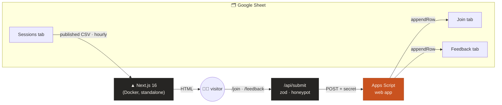
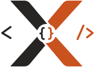

<div align="center">



<br>

**The website of CodeXLab, the coding club of Silver Oak University.**<br>
<sub>A club website built the way the club works: commits, pipelines, and a terminal that's waiting on you.</sub>

<br>


[`<Sessions/>`](#-sessions--git-log) · [`<Goals/>`](#-goals--growyml) · [`<Run/>`](#-run-it) · [`<Stack/>`](#-how-its-wired) · [`<Join/>`](#-git-commit--m-feat-add-you)

</div>

<br>

```ts
export const club = {
  name:   "CodeXLab",
  home:   "Silver Oak University",
  motto:  ["Har Line of Code, SOU Ke Mode.", "Har Code Se Future Onboard."],
  rule:   "nobody at SOU codes alone",
  status: "compiling…",
} as const;
```

<p align="center">
  
</p>

## `</>` The site *is* the logo

The CodeXLab mark is an **X made of four blades**. The two charcoal blades are code and the two ember blades are creativity. A `{ }` block sits where they cross, and `<` and `/>` sit on either side, so the whole logo reads as a self-closing JSX tag: **`<X/>`**. Every interaction on the site grows out of that one mark:

| On the site | What it does | Where it comes from |
|---|---|---|
| **Compile intro** | The blades fly in from the four corners and snap together, the `{ }` stamps in, and `<` `/>` slide in around them. The X then lands inside the wordmark | The logo, assembling itself |
| **Split-the-X reveal** | As you scroll, the charcoal half and the ember half part like curtains, and Sessions shows through the gap | The two blade colours |
| **`<Sessions/>` git log** | Every session the club has run is a commit with a hash, date, speaker, tags and attendees. Click one to expand it with photos and resources | "What we've shipped so far" |
| **`<Goals/>` as `grow.yml`** | The club's goals are CI stages that run as you scroll: *passed*, *running*, *queued*. The last stage, **deploy**, is **waiting on you** | A pipeline needs a runner |
| **`$ ./experience --codexlab`** | The call to action is a shell command, not a button. Clicking it "runs" it, and an X-shaped wipe takes you to `/join` | The terminal |
| **`<ThankYou/>` takeover** | When you submit a form, a full-screen terminal runs `git commit -m "feat: add <you> to CodeXLab"` and `git push`, and the server replies `✔ 201 Created` | Joining the club is a commit |
| **Bracket buttons** | On hover, `<` and `/>` slide in around the label, so **Join** becomes **`<Join/>`** | `<X/>` |
| **Branded 404** | `<NotFound/>`, with the note `// 404 · no such route` | Even errors stay on-brand |

<sub>Every animation uses only transform and opacity, and uses the same easing curve, <code>cubic-bezier(.16, 1, .3, 1)</code>. It all turns off when you set <code>prefers-reduced-motion</code>, and the content stays readable if JavaScript never loads.</sub>

## 🎨 Terminal Ember

<table>
<tr>
<td align="center"><br><code>#C9521F</code><br><sub>ember · the X</sub></td>
<td align="center"><br><code>#262523</code><br><sub>graphite · ink</sub></td>
<td align="center"><br><code>#F8F4EE</code><br><sub>cream · canvas</sub></td>
<td align="center"><br><code>#1A1917</code><br><sub>dark · code bands</sub></td>
<td align="center"><br><code>#5DB8A6</code><br><sub>terminal · <code>✔</code> only</sub></td>
</tr>
</table>

The colour split is about **80% cream, 15% graphite and 5% ember**. Ember is kept rare so that it stays loud, just like the single orange X in the wordmark. Headings are a geometric sans, and anything that talks like a machine is set in JetBrains Mono. The full system is in [`frontend/DESIGN.md`](frontend/DESIGN.md).

## 📜 Sessions = `git log`

Club members add sessions by typing a row into a **Google Sheet**; nobody touches code. The site reads the published Sessions tab and refreshes it **at most once an hour**, so there's no redeploy. If the Sheet can't be reached, the site falls back to [`sessions.fallback.json`](frontend/data/sessions.fallback.json) instead of showing an empty page.

```diff
  id | date       | title                        | speaker | tags         | summary | attendees | cover_image_url | photos | resources_url | status
+    | 2026-10-03 | Git & GitHub: your first PR  | Core    | Git, OSS     | …       | 64        | drive link      | …      | …             | published
-    | 2026-10-17 | Draft: Docker for students   | TBA     | DevOps       | …       |           |                 |        |               | draft
```

<sub><code>draft</code> and <code>hidden</code> rows stay off the site. Type dates as <code>YYYY-MM-DD</code> in a column formatted as plain text. Google Drive photo links work as they are, as long as they're shared as <i>Anyone with the link</i>.</sub>

## 🚦 Goals = `grow.yml`

```yaml
# .codexlab/grow.yml
stages:
  - learn:   { status: passed,  run: "Learn by building, not by watching." }
  - connect: { status: passed,  run: "Nobody at SOU codes alone." }
  - ship:    { status: running, run: "Ship real projects as a team." }
  - compete: { status: queued,  run: "Hackathons and open source." }
  - deploy:  { status: waiting, runner: you }   # ← the hook
```

## 🛠 How it's wired



- **Forms never talk to Google directly.** The browser posts to `/api/submit`. That route validates the data with the same zod schema the form uses, checks a hidden honeypot field, and only then forwards the data to Apps Script together with a secret. The Apps Script URL and the secret stay on the server and are never sent to the browser.
- **The Apps Script is scoped with `@OnlyCurrentDoc`**, so it can open this one spreadsheet and nothing else in the account.
- **The Sessions tab is the only tab that's published.** The Join and Feedback tabs contain students' details and stay private.

## ⚡ Run it

<table>
<tr><th>🐳 Docker (one click)</th><th>🧑‍💻 Dev server</th></tr>
<tr>
<td valign="top">

```bat
:: Windows: starts Docker Desktop if needed,
:: builds, runs, opens the browser
start.bat

:: stop it
stop.bat
```

</td>
<td valign="top">

```bash
cd frontend
npm install
cp .env.example .env.local   # optional
npm run dev                  # → localhost:3000
```

</td>
</tr>
</table>

Without `.env.local`, the site shows sample sessions and runs the forms in a simulated mode, so it works as soon as you clone it. To connect it to the real Sheet, follow [`apps-script/README.md`](apps-script/README.md) and fill in these values:

| Variable | What it is |
|---|---|
| `SESSIONS_CSV_URL` | The published CSV link for the **Sessions** tab only |
| `APPS_SCRIPT_URL` | The Apps Script web app's `/exec` URL |
| `APPS_SCRIPT_SECRET` | A long random string. It must match the `SECRET` script property |
| `NEXT_PUBLIC_SITE_URL` | The public URL, used for share previews. In Docker it's a build argument |

> [!CAUTION]
> Never commit `.env.local`. It's gitignored, so keep it that way.

## 🗺 Routes

| Route | What |
|---|---|
| `/` | The compile intro, the `CodeXLab` hero, the split-X reveal, Sessions, Goals and the hook button, then the footer |
| `/join` | Join form. First pick an intent (**Have a look**, **Join the club** or **Experience a session**), then fill in name, email, branch, year, enrollment number, roll number (optional), interests and a message |
| `/feedback` | Feedback for a session. `?session=<id>` preselects the session |
| `/api/submit` | Server-side relay that validates submissions and forwards them to Apps Script |
| `/lab` | Motion playground: every logo animation, each on its own (not linked from the site) |

## 🌳 Tree

```text
.
├── frontend/                 the Next.js app (everything web lives here)
│   ├── app/                  routes: /, /join, /feedback, /api/submit, /lab, 404
│   ├── components/
│   │   ├── logo/             the X, rebuilt from pixel measurements as SVG paths
│   │   ├── sections/         Hero · Sessions · Goals · HookButton · Nav · Footer
│   │   ├── forms/            JoinForm · FeedbackForm · ThankYou takeover
│   │   └── ui/               Bracket buttons, scramble text, the X wipe…
│   ├── lib/                  Sheet CSV loader, zod schemas, site config
│   ├── data/                 sessions.fallback.json
│   ├── DESIGN.md             tokens, type, motion rules
│   └── DECISIONS.md          every settled call, with the reason
├── apps-script/              Code.gs: the form receiver that writes to the Sheet
├── docker-compose.yml
└── start.bat · stop.bat
```

## ✍️ Editing

| Want to change… | Edit |
|---|---|
| Sessions, photos, resources | The Google Sheet's **Sessions** tab (no code needed) |
| Goals copy | [`frontend/components/sections/Goals.tsx`](frontend/components/sections/Goals.tsx) |
| Socials, email, tagline | [`frontend/lib/site.ts`](frontend/lib/site.ts) |
| Colours, type, motion | [`frontend/DESIGN.md`](frontend/DESIGN.md) → `app/globals.css` |
| Logo assets | `npm run brand` (regenerates `public/brand/` from the geometry) |

## 🤝 `git commit -m "feat: add <you>"`

The pipeline has one stage left, and it's `deploy`, waiting for a runner.

- **Students at SOU:** open the site, run `$ ./experience --codexlab`, and pick *Have a look*, *Join the club* or *Experience a session*.
- **Contributors:** open a PR. Keep commits conventional (`feat:`, `fix:`, `docs:`), keep motion on transform and opacity only, and add a row to `DECISIONS.md` when you make a call someone might later question.

<br>

<p align="center">
  
</p>

<p align="center">
  " width="56"><br>
  <sub><b>CodeXLab</b> · Coding Club · <a href="https://silveroakuni.ac.in">Silver Oak University</a></sub>
</p>
